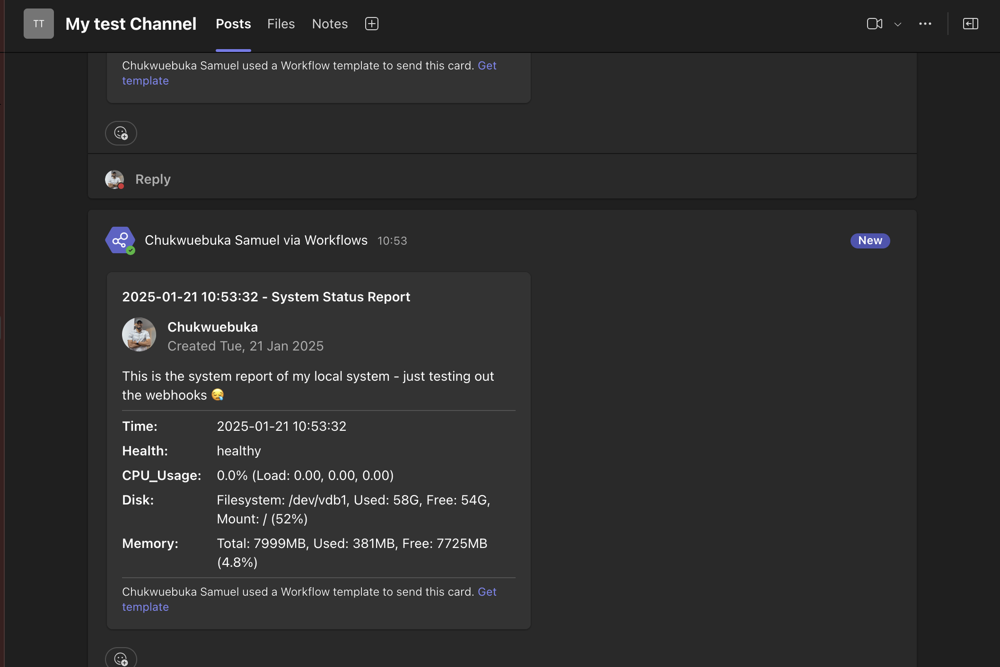

# Devops Week 3 Month 2 Assignment

## System-monitor Installation

The assignment can be installed via the command line.

> **INFO:** You can set an environment variable in your `~/.zshrc` or `~/.profile` (YOU ACTUALLY SHOULD):

```bash
export WEEK2_TEAMS_WEBHOOK_ENV=<teams_webhook_url>
```

> **Note:** Replace `<teams_webhook_url>` with your actual Microsoft Teams webhook URL.
Your system monitor information will be sent to your `<teams_webhook_url>`. Otherwise, The information will be sent to a default `WEEK2_TEAMS_WEBHOOK_ENV` in the script and I (The Author) will be the one receiving the information 😭 😭.

If `name_of_command` is not provided, the script will be installed as **system-monitor**. (cute name if you asked me 🌚🌚)

```bash
# clone the repository
$ git clone https://github.com/X4MU-L/private-make-assignment.git <dir_name>
# change dir into the project directory
$ cd month2-week3-assignment # or cd <dir_name>
# install the project (you can provide an optional project name for the script)
$ sudo make install [PROJECT_NAME=name_of_command]
# you can as well run system-monitor to initiate the script outside of the systemd
# you can optionally set the env variable as a one line variable to the shell session (best to export to the shell session 😪 or add to ~/.zshrc or ~/.profile for the systemd Use)
$ [WEEK2_TEAMS_WEBHOOK_ENV=<teams_webhook_url>]  system-monitor # or <name_of_command>
```

```bash
# One line command
$ curl -sSL https://raw.githubusercontent.com/X4MU-L/private-make-assignment/main/install.sh | sudo bash
# you can as well run system-monitor to initiate the script outside of the systemd
# you can optionally set the env variable as a one line variable to the shell session (best to export to the shell session 😪 or add to ~/.zshrc or ~/.profile for the systemd Use)
$ [WEEK2_TEAMS_WEBHOOK_ENV=<teams_webhook_url>] system-monitor
# or
$ curl -sSL https://raw.githubusercontent.com/X4MU-L/private-make-assignment/main/install.sh | sudo bash -s -- <name_of_command>
# you can as well run <name_of_command> to initiate the script outside of the systemd
# you can optionally set the env variable as a one line variable to the shell session (best to export to the shell session 😪 or add to ~/.zshrc or ~/.profile for the systemd Use)
$ [WEEK2_TEAMS_WEBHOOK_ENV=<teams_webhook_url>]  <name_of_command>

```

### Example of teams webhook information

I apologize in a advance that my image and name 🤓 🌚 will be the one appearing in the webhook information (hoping to probably modify this in future, nevertheless, your PR will be appreciated)



## Create Nginx server and capture and analyze packages

```bash
sudo bash capture_nginx
# or run
sudo ./capture_nginx
```

```bash
sudo tcpdump -i any port 80 -w nginx_traffic.pcap
```

In a different terminal:

```bash
curl http://localhost
```

```bash
# Read and analyze the captured packets using Wireshark
wireshark -r nginx_traffic.pcap
```
